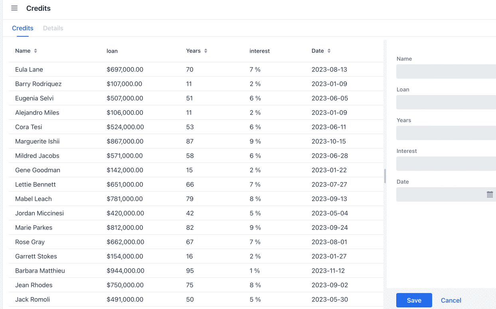
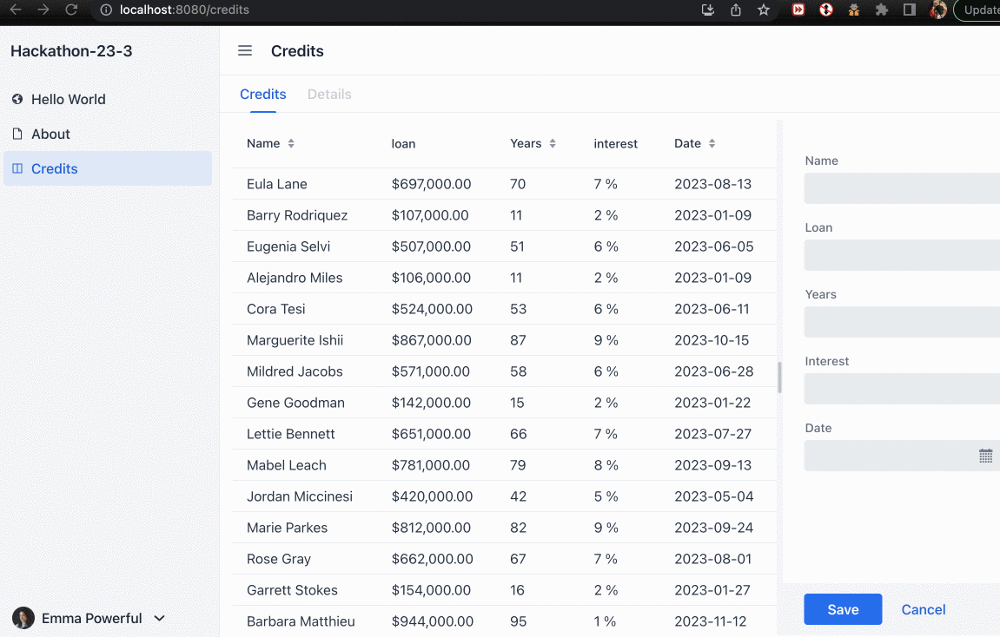
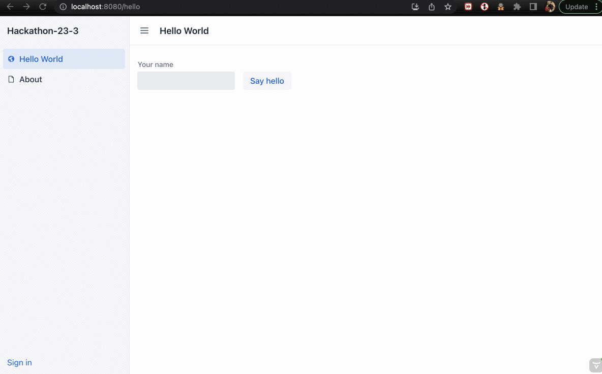
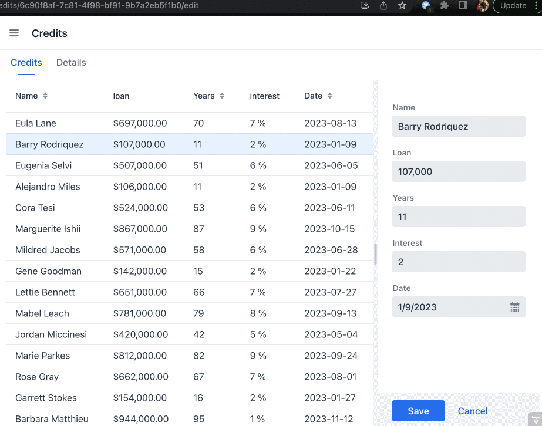

# Hackathon-23-3 (manolo)

### Achivements

#### SamplePerson -> Credits

Changed DataModel and View for handling Credits instead of Persons

####  23.3 feature:  Amortization Excel file in SpreadSheet view

Added an excel file that allows configuring and viewing loan amortization table.

####  23.3 feature: Use new components TabSheet and ToolTip

Added new component TabSheet for switching between the credit view and the amortization spreadsheet.

When switching between both, the modified values are preserved from one tab to another.



####  23.3 feature: Configure PreserveOnRefresh

Using the new feature `isRefreshEvent` to allow reloading the UI without any [issue](https://github.com/vaadin/flow/issues/14999) when using route paths for editing entities.




####  Stateless Autentication

Configured user authentication to be stateless for easing deploying in cloud, as well as better reloading experience when in dev-mode



####  23.3 feature: added kubernetes ClusterSupport Dependency

It allows showing a notificator with the new version when certain headers are set by the ingress controller in the cluster.



####  23.3 feature: added K8s manifests.

There is a script for compiling, and deploying two versions of the application image in a Docker hub, and the necessary manifests for deploying them and switching versions.

  - create images
  You need to edit `Dockerfile` and set the appropriate pro license
```
  ./build-app.sh
```
  - install ingress in your K8s cluster
```
  ./install-ingress.sh
```
  - deploy App in the cluster
```
    for i in deployment/*yaml
    do
       kubectl apply -f $i
    done
```
